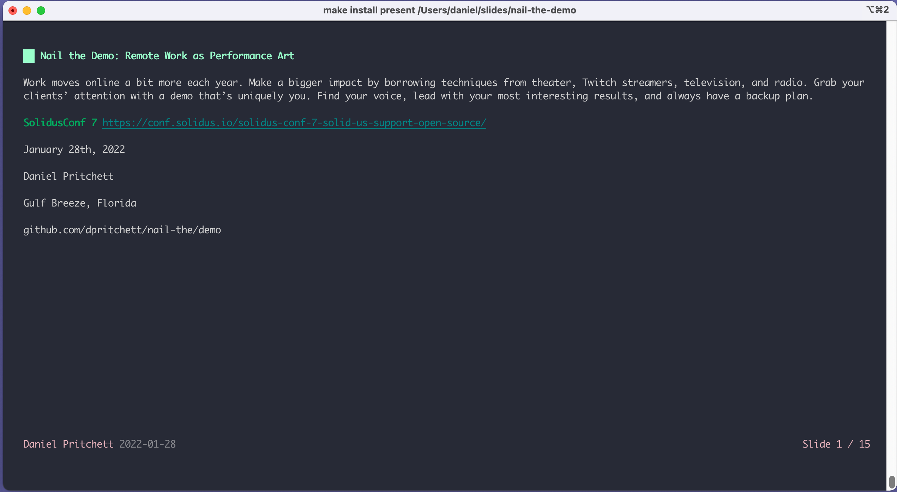
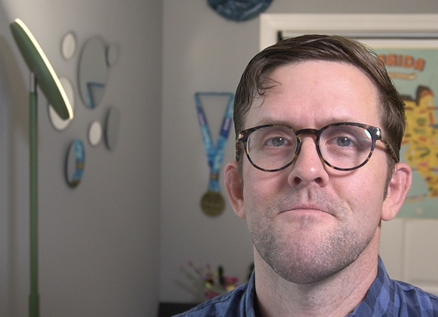

# Nail the Demo: Remote Work as Performance Art

Presented to SolidusConf 7 on 28 January 2022.

> Work moves online a bit more each year. Make a bigger impact by borrowing techniques from theater, Twitch streamers, television, and radio. Grab your clients’ attention with a demo that’s uniquely you. Find your voice, lead with your most interesting results, and always have a backup plan.

- Daniel Pritchett
  - [@dpritchett](https://twitter.com/dpritchett) on Twitter
  - [@dpritchett](https://github.com/dpritchett) on GitHub

## How to run this locally

_Built+tested on a Mac with Homebrew_

- `make install present`

`slides` should render the presentation in your terminal like so:

| Title Slide | Author Selfie from demo day |
| --------------- | --------------- |
|  |  |